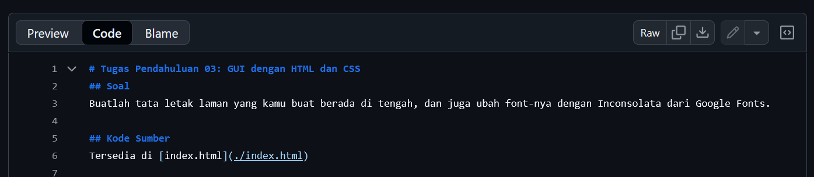

# Tugas Mandiri: Menulis Markdown

**Nama:** Yanti Caroline  
**NIM:** 2211105000  
**Kelas:** SE-08-00

## Tugas

Buatlah deskripsi tugas yang menambah nilai praktikum!

## Program/Kode

Tersedia di [TM ini](./TM_99_Menulis_Markdown.md).

## Output

## Deskripsi

Gambar di atas menunjukkan cara mendapatkan kode sumber Markdown di GitHub. Cukup dengan mengklik tab `Code`, kita bisa mendapatkan kode sumber utuh dari Markdown.

Saya menaruh dua gambar di atas sebagai perbandingan antara Markdown yang sudah dirender (atas) dengan kode sumber Markdown (bawah). Gambar atas sendiri juga jelas konteksnya dengan tab yang aktif adalah `Preview`.

Di GitHub sendiri ada juga tab `Blame`. Ini digunakan untuk mengetahui siapa saja yang mengubah isi berkas dan sebagai lelucon untuk _menyalahkan_ (bahasa Inggrisnya: blame) si pengedit jika ada yang tidak beres dengan perangkat lunak.
